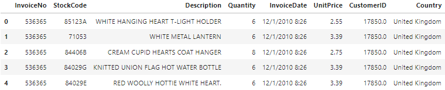
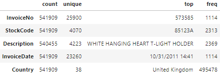
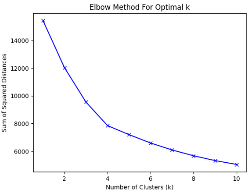

# Product Recommendation by Customer Segmentation
## Abstract
In the landscape of online retail, understanding customer behaviour and preferences is paramount for effective marketing strategies and enhanced sales. Segmentation of customers based on transactional and behavioural similarity between each other is very much helpful in the Online Retail field. It gives a thorough understanding of the way customers belonging to a particular segment spend their money and what kind of products they prefer to buy by analysing the spending pattern of other customers in that segment or cluster. This project aims to connect data analysis with marketing strategies, giving retailers the tools to improve how they reach customers and grow their business in the constantly changing online market. Our primary objective is to transform a raw transactional data that is collected from a retailer, and available online, into a customer-centric dataset favourable to segmentation analysis. This involves data cleaning procedures to handle missing values, duplicates, and outliers, ensuring the integrity and reliability of our dataset. Further, we engage in feature engineering process to generate new variables, based on the RFM (Recency, Frequency, Monetary), model that encapsulate crucial aspects of customer behaviour and transaction history. Then we employ the K-means clustering algorithm and partition the customers into distinct clusters based on the features in the Customer centric data built from the initial transactions data. We then evaluate the clusters (segments) through the k – means cluster evaluation metrics and proceed to the next step of building a recommendation system to enhance cross-selling opportunities and boost sales. The recommendation system uses cluster-specific product recommendations, suggesting top-selling items to customers within each segment who have yet to make corresponding purchases. This personalized approach aims to increase marketing effectiveness by presenting customers with products aligned with their preferences and purchase history, thereby increasing sales and customer loyalty. This project emphasizes the importance of customer segmentation in the field of online retail by recommending products bought by the customers of their segment and thus helping increase the customer satisfaction and sales. Through the integration of advanced analytics techniques and machine learning algorithms we contribute to enhancing customer experiences and sustainable business growth. 
## 1. Introduction
In online retail, understanding customer behavior is crucial for creating effective marketing strategies and driving sales. Customer segmentation, which involves dividing customers into distinct groups based on shared characteristics, plays a key role in this process. By segmenting customers, marketers can tailor their offerings and communication to meet the specific needs of each group, thereby enhancing customer engagement and loyalty.
### 1.1 Customer Lifetime Value and Behaviour
Segmentation involves analyzing customer data, including demographics and purchasing patterns, using advanced analytics techniques. This helps identify homogeneous customer groups with distinct preferences, laying the groundwork for targeted marketing initiatives. One important aspect of segmentation is considering customer lifetime value (CLV), which reflects the long-term revenue a customer can generate. By focusing on CLV, marketers can prioritize resources and strategies to maximize long-term customer relationships, driving sustained business growth.
Another key tool in understanding customer behavior is the RFM model, which categorizes customers based on recency, frequency, and monetary value. Recency indicates how recently a customer made a purchase, frequency shows how often they buy, and monetary value reflects their spending power. By analyzing these metrics, marketers can better understand individual behaviors and tailor marketing efforts accordingly, enhancing customer profiling and engagement.
### 1.2 Segmentation and Product Recommendation
Various segmentation methodologies exist, including traditional demographic approaches and more advanced techniques like clustering algorithms. Hierarchical clustering and K-means clustering are popular methods used in customer segmentation. Hierarchical clustering organizes customers into a tree-like structure based on similarities, while K-means clustering partitions customers into distinct groups based on purchasing behavior. K-means is particularly effective in handling large datasets, making it ideal for e-commerce applications. It enables marketers to derive actionable insights for targeted marketing strategies and personalized product recommendations.
Product recommendation systems are essential in modern e-commerce, enhancing the shopping experience by offering personalized product suggestions. These systems analyze customer data, such as browsing history and purchase patterns, to generate tailored recommendations. By integrating customer segmentation analyses, recommendation systems can further refine their suggestions, aligning them with the preferences of specific customer segments. Clustering customers into distinct groups allows for identifying popular products within each segment, enabling intelligent cross-selling and driving sales growth.

This project aims to leverage customer segmentation techniques, particularly K-means clustering, to identify common preferences within customer segments. The goal is to develop a product recommendation system that suggests top-selling products to customers who have not yet made corresponding purchases. This approach is expected to enhance marketing effectiveness, boost sales, and improve customer satisfaction in the competitive online retail landscape.

## 2. Methodology and Discussion
### 2.1 Dataset Description
*Online retail dataset:* https://archive.ics.uci.edu/dataset/352/online+retail

This dataset, sourced from the UCI Machine Learning Repository, encapsulates the dynamic landscape of online retail, documenting all transactions transpired between the years 2010 and 2011. The dataset comprises 541,909 entries curated across 8 columns. 

The column descriptions of the dataset:
| **Column Name** | **Description** |
|-----------------|-----------------|
| **InvoiceNo**   | A 6-digit code representing each unique transaction. If the code starts with the letter 'C', it indicates a cancellation. |
| **StockCode**   | A 5-character code uniquely assigned to each distinct product. |
| **Description** | The name or description of each product. |
| **Quantity**    | The number of units of a product involved in the transaction. |
| **InvoiceDate** | The date and time when the transaction occurred. |
| **UnitPrice**   | The unit price of the product in sterling (£). |
| **CustomerID**  | A unique identifier assigned to each customer. |
| **Country**     | The country where the customer is located. |

### 2.2 Exploratory Data Analysis
Exploratory Data Analysis (EDA) serves as a fundamental step in the data analysis process, allowing researchers to gain insights, visualize data, identify underlying patterns, distributions etc.
#### 2.2.1 Summary Statistics 

One essential aspect of EDA is summary statistics, which provide a concise overview of the dataset's central tendency, dispersion, and shape. Measures such as mean, median, and standard deviation offer insights into the dataset's distribution and variability, while quantiles and percentiles reveal its spread and skewness. It helps in understanding the overall characteristics of the data and identify potential outliers or anomalies that may warrant further investigation.

Figure 1 Head of the transactional dataframe 

Figure 2 Descriptive statistics of Numerical columns 

Figure 3 Descriptive statistics of Categorical columns 

From the summary statistics we observe that the average quantity of products per transaction stands at approximately 9.55, suggesting that customers typically purchase multiple items in a single transaction. However, the wide range of quantity values, spanning from -80995 to 80995, indicates the presence of returned or cancelled orders, necessitating appropriate handling to ensure data accuracy and integrity. The substantial standard deviation underscores the significant spread in the data, indicative of the presence of outliers that warrant further investigation and treatment. Similarly, the average unit price of products is approximately 4.61, with a wide range extending from -11062.06 to 38970. The presence of negative prices is anomalous. The CustomerID column exhibits 406829 non-null entries, signifying the presence of missing values that require attention.
In terms of product representation, the dataset encompasses 4070 unique stock codes and 4223 unique product descriptions. The most frequent stock code, 85123A, appears 2313 times, while the most frequent product description, "WHITE HANGING HEART T-LIGHT HOLDER," occurs 2369 times. However, the presence of missing values in the Description column necessitates appropriate treatment to maintain data completeness and accuracy. Furthermore, transactions originate from 38 different countries, with the United Kingdom accounting for approximately 91.4% of the total transactions.
Overall, these summary statistics provide a comprehensive overview of the dataset's characteristics, guiding further exploration and analysis to extract actionable insights and drive informed decision-making in the realm of online retail.

#### 2.2.2 Visualization 

Visualization techniques play a crucial role in EDA, enabling researchers to explore data through graphical representations that enhance understanding and interpretation. Common visualization tools include histograms, box plots, scatter plots, and density plots, each offering unique insights into different aspects of the data distribution and relationships between variables. Heatmaps and correlation matrices provide visualizations of pairwise relationships between variables, facilitating the identification of patterns and dependencies within the dataset.  
The following figures are such visualizations created for understanding the Top 20 Most Frequent Stock Codes and the country wise sales distribution. 

 

Figure 4 Top 20 Most Frequent Stock Codes

Figure 5 Top Countries by Proportion 

#### 2.2.3 Initial Data Cleaning and Preprocessing 
EDA also involves steps like initial data cleaning and preprocessing to ensure dataset quality before analysis. This includes handling missing values, outliers, and inconsistencies, as well as transforming variables to meet modeling requirements. Data normalization and standardization may also be applied to improve model performance.

Initially, addressing missing values and duplicates is essential for maintaining the dataset's integrity. The dataset revealed 1456 missing values in the Description column and 135,080 in the CustomerID column, accounting for 0.27% and 24.93% of missing data, respectively. Given that CustomerID is vital for clustering and recommendation systems, imputing such a large portion of missing data could introduce bias. Thus, removing rows with missing CustomerIDs is crucial for accurate analysis. Similarly, removing rows with missing Descriptions is advisable due to inconsistencies in data, where the same StockCode might not consistently match the Description. Additionally, the dataset contained 5225 duplicate rows, likely due to data recording errors rather than genuine repeated transactions. Retaining these duplicates could introduce noise and inaccuracies in clustering and recommendation systems. Removing these duplicates is essential for a cleaner dataset, enabling more precise customer clustering based on unique purchasing behaviors. After handling null values and duplicates, the dataset was reduced to 401,604 rows, a necessary step to ensure data integrity and reliability for subsequent analyses. This reduction paves the way for more accurate insights, leading to better decision-making in online retail.

The statistical analysis of the UnitPrice column revealed that some transactions had a unit price of zero, suggesting either free items or data entry errors. A closer examination showed these zero-price transactions were rare, with only 33 instances, but they varied widely in the quantity of items, from 1 to 12,540, with a significant standard deviation. This variability could disrupt clustering analysis by introducing noise and distorting customer behavior patterns.
To maintain a consistent dataset, removing these zero-price transactions is the most prudent strategy. This approach minimizes noise and enhances the accuracy and reliability of clustering analysis, ensuring that meaningful customer segments are identified based on genuine purchasing behaviors. This decision strengthens the foundation for developing a more accurate recommendation system tailored to diverse customer preferences in online retail.

### 2.3 Feature Engineering
To create a customer-centric dataset for clustering and recommendation systems, we focus on feature engineering, leveraging the data to extract meaningful insights and enhance our model's analytical capabilities. Our customer-centric dataframe, 'customer_data,' serves as the foundation for understanding customer behavior and preferences through carefully crafted features tailored to the retail landscape.

At the core of our feature engineering process is the integration of the RFM (Recency, Frequency, Monetary) analysis, a proven method for assessing customer value and segmenting the customer base based on buying behavior. RFM consists of three dimensions: Recency, Frequency, and Monetary value, which provide a comprehensive framework for understanding and segmenting customers.

**Recency (R)** focuses on how recently a customer made a purchase. We create the "Days Since Last Purchase" feature to quantify the number of days since the customer's most recent transaction. A lower value indicates more recent engagement, allowing businesses to target customers who haven't made recent purchases and potentially increase retention.

**Frequency (F)** measures the extent of a customer's engagement. We develop two features: "Total Transactions" and "Total Products Purchased." The former counts the total number of transactions per customer, indicating overall engagement, while the latter measures the total quantity of products purchased across all transactions. These features help segment customers by their frequency of engagement, enabling targeted marketing strategies and personalized recommendations.

**Monetary (M)** addresses the financial aspect of customer transactions. We create "Total Spend," which calculates the total amount of money spent by each customer, and "Average Transaction Value," which divides Total Spend by Total Transactions. These features offer insights into a customer's financial value and spending behavior, which are crucial for tailoring marketing strategies to different customer segments.

In addition to RFM features, we further enrich our dataset with additional dimensions that provide deeper insights into customer behavior. One key aspect is **Product Diversity**, captured by the "Unique Products Purchased" feature, which quantifies the variety of products a customer buys. A higher value indicates diverse tastes, while a lower value suggests more focused preferences. This feature aids in creating personalized product recommendations.

We also introduce **Behavioral Features**, such as "Average Days Between Purchases," which calculates the average time a customer waits between purchases. This metric helps predict future buying patterns and informs targeted marketing efforts.

**Cancellation Insights** offer a glimpse into customer dissatisfaction. We create "Cancellation Frequency" and "Cancellation Rate" to quantify and normalize the number of canceled transactions. High cancellation rates may indicate an unsatisfied customer segment, requiring targeted strategies to improve their shopping experience.

The 'customer_data' dataframe now includes features such as CustomerID, Days Since Last Purchase, Total Transactions, Total Products Purchased, Total Spend, Average Transaction Value, Unique Products Purchased, Average Days Between Purchases, Cancellation Frequency, and Cancellation Rate. These features provide a comprehensive understanding of customer behavior and preferences, enabling businesses to develop targeted marketing strategies and personalized recommendations. By incorporating these features, we enhance our ability to segment customers effectively, driving satisfaction and business growth.

Column descriptions of the customer_data:
| **Column Name**                 | **Description**                                                                                                                                 |
|---------------------------------|-------------------------------------------------------------------------------------------------------------------------------------------------|
| **CustomerID**                  | Identifier uniquely assigned to each customer, used to distinguish individual customers.                                                       |
| **Days_Since_Last_Purchase**    | The number of days that have passed since the customer's last purchase.                                                                         |
| **Total_Transactions**          | The total number of transactions made by the customer.                                                                                          |
| **Total_Products_Purchased**    | The total quantity of products purchased by the customer across all transactions.                                                               |
| **Total_Spend**                 | The total amount of money the customer has spent across all transactions.                                                                       |
| **Average_Transaction_Value**   | The average value of the customer's transactions, calculated as total spend divided by the number of transactions.                              |
| **Unique_Products_Purchased**   | The number of different products the customer has purchased.                                                                                    |
| **Average_Days_Between_Purchases** | The average number of days between consecutive purchases made by the customer.                                                                |
| **Preferred_Day**               | The preferred day of the week for the customer's purchases.                                                                                     |
| **Preferred_Hour**              | The preferred hour of the day for the customer's purchases.                                                                                     |
| **Cancellation_Frequency**      | The total number of transactions that the customer has cancelled.                                                                               |
| **Cancellation_Rate**           | The proportion of transactions that the customer has cancelled, calculated as cancellation frequency divided by total transactions.             |

### 2.4 Data Preprocessing
Data preprocessing is essential for transforming raw data into a format suitable for analysis. This process involves tasks like handling missing values, removing duplicates, and formatting data to improve quality and usability. Proper preprocessing ensures the dataset is clean, consistent, and ready for analysis, paving the way for accurate and reliable insights.
#### 2.4.1 Initial Steps
We began by refining the 'customer_data' dataframe, checking for columns with identical or entirely unique values, which might be redundant. Fortunately, no such columns were found. Every column, including the `CustomerID`, contains valuable and distinct data, making them essential for further analysis and modeling. As a result, no columns were removed, and the dataset was retained in its entirety for subsequent cleaning and analysis.
#### 2.4.2 Outlier Treatment
Outliers are data points that significantly deviate from others in the dataset, often resulting from measurement errors, data entry mistakes, or genuine anomalies. They can skew statistical analyses and machine learning models if not properly addressed. Detecting outliers involves using summary statistics like the mean, median, and standard deviation, along with visualization tools such as box plots and scatter plots. More advanced techniques, like clustering methods and machine learning algorithms, can be used for multidimensional datasets.

Once outliers are identified, several strategies can be used to address them:
- **Removal:** Outliers that result from errors can be removed, but this must be done carefully to avoid biasing the analysis.
- **Transformation:** Techniques like logarithmic transformation or winsorization adjust extreme values, making the data distribution more symmetrical without discarding data.
- **Imputation:** Missing or extreme values can be estimated using methods like mean or median replacement, but care must be taken to avoid introducing bias.
- **Robust Statistical Methods:** These methods, such as robust regression, are less sensitive to outliers and provide more reliable estimates.
- **Modeling Techniques:** Models like support vector machines or tree-based algorithms handle outliers effectively without explicit treatment.

A common approach to outlier treatment is capping and flooring, where extreme values are adjusted within set bounds. The interquartile range (IQR) method is particularly robust, using the first and third quartiles to determine these bounds. Data points falling outside these bounds are adjusted, stabilizing statistical measures and reducing the impact of outliers on subsequent analyses.

Figure 6: Boxplot before Outlier Treatment

The process involves examining each numeric variable, adjusting data points that fall outside the determined bounds. This reduces the influence of outliers on statistical measures like the mean and standard deviation, ensuring that analyses accurately reflect the data's underlying patterns. It also improves the robustness of machine learning models, preventing overfitting and leading to better generalization on new data.
Outlier treatment enhances the interpretability of results by eliminating distortions caused by extreme values, allowing for clearer analysis of relationships between variables.

Figure 7: Boxplot after Outlier Treatment

In summary, outlier treatment is a crucial preprocessing step that involves identifying and adjusting extreme values using methods like the IQR. This ensures the reliability, stability, and interpretability of analysis results, supporting informed decision-making and the development of accurate predictive models.

#### 2.4.3 Dimensionality Reduction

Dimensionality reduction simplifies datasets by reducing the number of features while retaining as much relevant information as possible. This often involves removing highly correlated columns, which contain redundant information due to strong linear relationships. Reducing such redundancy helps avoid issues like overfitting, decreases computational complexity, and improves the interpretability of results.
After identifying highly correlated columns, we decide which to retain based on relevance to analysis objectives, model interpretability, and computational efficiency. By removing less relevant or redundant columns, we maintain the diversity of information while simplifying the dataset.
In this process, we used correlation matrices, heatmaps, and correlation plots to thoroughly examine the dataset's correlation structure. This allowed us to identify and remove highly correlated columns, effectively reducing the dataset's dimensionality. The result is a more manageable dataset that still contains the essential information needed for accurate and robust analysis.
Dimensionality reduction enhances the performance and efficiency of machine learning algorithms, making predictive modeling more accurate and reliable.

Figure 8 Correlation heatmap of customer_data

By visualizing the correlation matrix as a heatmap, we identified strong correlations between certain columns. Specifically, 'total spend' and 'total products purchased' had a correlation coefficient exceeding 0.8, as did 'cancellation rate' and 'cancellation frequency.' 'Total spend' also correlated highly with 'total transactions.' Due to these high correlations, we removed redundant columns to reduce multicollinearity, opting to keep 'total spend' and 'cancellation rate' for their valuable insights. This reduction enhanced computational efficiency and improved the interpretability of the dataset, allowing for more accurate and robust analysis by focusing on the most relevant features.

### 2.5 The K – Means Clustering 

In the realm of unsupervised machine learning, cluster analysis stands as a formidable technique, wielding the power to unveil hidden patterns within data. At the forefront of this methodology lies the K-Means algorithm, a stalwart tool revered for its simplicity and effectiveness. Coupled with sophisticated evaluation techniques such as the Elbow Method and Silhouette Score, K-Means empowers data scientists to segment datasets into distinct clusters with precision. In this exploration, we delve into the intricacies of these methodologies, illuminating their inner workings and practical applications. 

#### 2.5.1 Optimal K: The Elbow Method 

The Elbow Method helps identify the optimal number of clusters by finding the point where adding more clusters no longer significantly reduces the within-cluster sum of squares. The Elbow Method includes the following steps:
- Execution of K-Means: Apply the K-Means algorithm for a range of K values.
- Calculation of Within-Cluster Sum of Squares (WCSS): Compute the sum of squares of distances between data points and their respective centroids within each cluster.
- Identification of Elbow Point: Plot the WCSS against the number of clusters (K) and identify the point where the rate of decrease sharply decelerates, resembling an elbow. 

Figure 9 Elbow curve 

Plotting the elbow curve, we observed a significant decrease in the within-cluster sum of squares (WCSS) as we increased the number of clusters up to a certain point. However, beyond this point, the reduction in WCSS became marginal, indicating that additional clusters did not contribute substantially to explaining the variance within the data. This pivotal point, where the curve exhibited a noticeable flattening, occurred at K = 4. 

#### 2.5.2 Clustering 
K-Means is used to partition a dataset into K clusters, where each observation belongs to the cluster with the nearest mean, or centroid. The algorithm iteratively refines these centroids until convergence, minimizing the within-cluster sum of squares, thereby optimizing cluster cohesion.
The algorithm's simplicity lies in its iterative nature, which comprises the following steps: 

- Choose the number of clusters (k) and obtain the data points 
- Place the centroids c1, c2,....., ck randomly
- Repeat steps 4 and 5 until convergence or until the end of a fixed number of iterations
- for each data point Xi:
  - find the nearest centroid (c1, c2,....., ck)
  - assign the point to that cluster
- for each cluster j = 1...k:
  - new centroid = mean of all points assigned to that cluster
- End, once convergence is achieved, the data points are divided into k clusters, and each data point is associated with a specific cluster. 

While K-Means excels in efficiency and scalability, its effectiveness hinges on selecting an appropriate value for K, the number of clusters.
We determined that the optimal number of clusters is K = 4. Armed with this insight, we proceeded to apply the K-Means algorithm with K set to 4, effectively partitioning our dataset into three distinct clusters.

The clustering results unveiled four distinct clusters, each characterized by a unique set of features and data points: 
| Cluster | Number of Data Points |
|---------|-----------------------|
| 0       | 1371                  |
| 3       | 1240                  |
| 2       | 842                   |
| 1       | 832                   |

#### 2.5.3 Evaluating Cluster Quality
Beyond selecting an optimal K, assessing the quality and coherence of clusters is imperative.
- **Calinski-Harabasz Index: 1378.0** - This index assesses cluster quality based on the variance between and within clusters, with a value of 1378.0 indicating good cluster separation and cohesion.
- **Davies-Bouldin Index: 1.3** - This index measures the average similarity ratio of each cluster with its most similar cluster, and a value of 1.3 implies a moderate level of cluster separation.
- **Silhouette Score: 0.23** - This assesses the level of cluster cohesion and separation. The range of Silhouette Score is [-1,1] with 1 indicating the best clustering.

These robust scores provide validation for the effectiveness of our clustering approach and asserted the presence of meaningful patterns within the data. 

Now, we add a new column to our customer data labelled "Cluster", we assigned each observation to its respective cluster based on the clustering results obtained through the K-Means algorithm. This integration of cluster assignments into the customer data facilitated further analysis and segmentation, empowering us to leverage the insights gleaned from cluster analysis in downstream tasks such as targeted marketing, customer segmentation, and personalized recommendations. 
In conclusion, the successful application of the Elbow Method, K-Means algorithm, and the evaluation techniques enabled us to unravel hidden patterns within our dataset and derive actionable insights.

### 2.6 Recommendation system 

Recommendation systems are essential for enhancing user experience and engagement across various platforms, from e-commerce to streaming services. They utilize data-driven insights to provide personalized recommendations tailored to individual preferences. One effective method for achieving this personalization is customer segmentation through techniques like K-Means clustering. By grouping customers based on purchasing patterns, preferences, and demographics, businesses can gain valuable insights into customer behavior. This segmentation forms the basis for creating targeted recommendations that cater to each cluster's unique characteristics, thereby improving customer satisfaction and loyalty.
In addition to K-Means clustering, there are other methods for building recommendation systems. Collaborative filtering analyzes user behavior to recommend items similar to those previously liked. Content-based filtering recommends items based on their attributes and the user's past behavior. Hybrid approaches combine both methods for more accurate recommendations. Matrix factorization techniques decompose user-item interactions to uncover latent factors, enhancing recommendation quality. Deep learning models use neural networks to process large datasets and generate personalized recommendations.

For our project, we employed K-Means clustering for customer segmentation to refine our recommendation system. This process starts with preprocessing transaction data, including customer identifiers (CustomerID), product codes (StockCode), quantities purchased, and transaction timestamps. Alongside, demographic and purchase history data are prepared for segmentation. The K-Means algorithm clusters customers based on purchasing behavior, creating distinct segments with similar preferences. After segmentation, transaction data is integrated with customer data to associate transactions with cluster assignments, helping identify top-selling products within each cluster.
The integrated dataset allows us to track products purchased by each customer within their cluster, forming the basis for personalized recommendations. Recommendations are made based on popular products in each cluster that customers haven't yet purchased, ensuring relevance and appeal. The final step involves creating a structured record of recommendations, including customer identifier, cluster assignment, and the top three recommended products tailored to each customer's preferences.

Overall, recommendation systems powered by K-Means customer segmentation enable businesses to leverage their data effectively, providing targeted recommendations that match individual preferences. This approach offers deeper insights into customer behavior, leading to personalized recommendations that boost engagement and foster long-term relationships.

### 2.7 Results
The result dataframe consists of the customer ID, Cluster or segment of the customer, and the stock codes, descriptions of the top 3 products that are recommended to the customer based on the top 10 products in the cluster the person belongs to. The following figure shows the head of the recommendations dataframe. 

Figure 10 Head of the recommendations dataframe 

## 3. Conclusion
Our project demonstrates the effectiveness of leveraging data-driven insights for personalized customer experiences, from meticulous data preparation and customer segmentation to developing a tailored recommendation system. By cleaning data, fixing errors, and using K-Means clustering, we successfully grouped customers based on similar behaviors, allowing us to craft targeted recommendations and marketing strategies. This approach not only enhanced customer satisfaction but also optimized sales and marketing efforts by focusing on group-specific preferences.
Looking ahead, we aim to refine our approach by enhancing data exploration and cleaning, incorporating additional customer features such as demographics and interaction history, and applying advanced techniques like deep learning and ensemble methods. Exploring external data sources, such as social media activity, could further enrich our insights. Continued optimization of our recommendation algorithm will ensure it remains effective amidst evolving customer preferences and market conditions. Future efforts will focus on innovation and experimentation to deliver even more personalized and impactful experiences.
